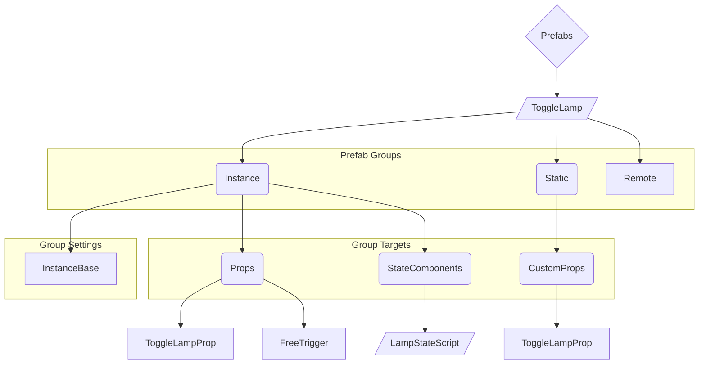
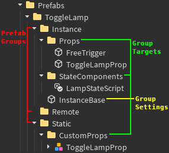
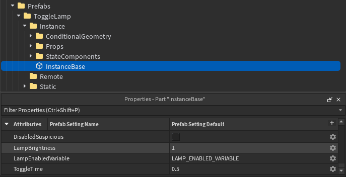
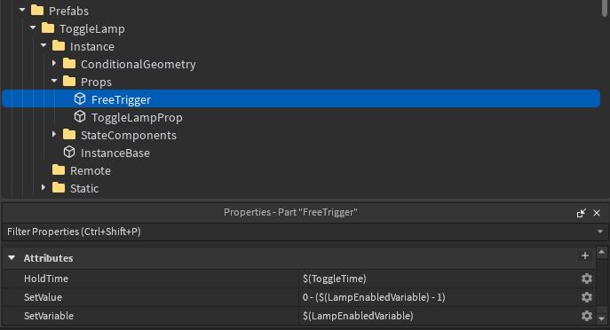
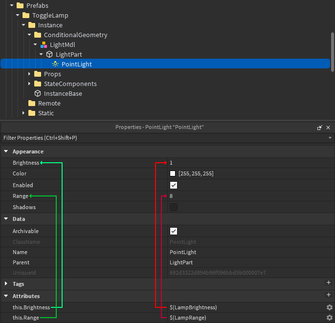

# Demystifying Prefabs // Part 1: The Basics
## Previous Entry: [0.0: Documentation Usage](./0_0_StartHere.md) / [0.5: Background](./0_5_Background.md)
##     Next Entry: [1.5: StateWrangler](./1_5_StateWrangler.md) / [2.0: Advanced Attributes](./2_0_AdvancedAttributes.md)

# Subject
An overview of the basic structure of a prefab, as well as the Instances which make up that structure, and their classifications.

# Content

## The Basics
At a high level, simple prefabs look like the following graph:

Which is the same as this Roblox Studio Layout:  

They're composed of a couple things, internally the plugin breaks these down into:
- Prefab Groups
- Group Targets
- Group Settings[^SettingsImplDetail]
[^SettingsImplDetail]: Group Settings aren't actually a fully-fledged internal concept (although they probably should be) - it's just useful to describe them as if they are

Prefab Groups are the foundation of everything in your prefab, being the folders right at the top of your prefab. There are currently three valid groups, seen above.

For all groups, the folders contained within should all correspond to a folder in your mission. These are **Group Targets**, and will be treated differently depending on which group they're in.

Anything inside of a group which isn't a folder is a **Group Setting**, these differ per-group. Some groups may have none where other groups may have some that are required.

To briefly touch on each of the groups we just listed, in order of Least Important -> Most Important:
- The **Remote** Group is an *extremely* niche and advanced feature you shouldn't worry about for now, you likely won't need it.
- The **Static** Group is for assets like CustomProps which you only need one copy of that are used in the **Instance** group - so you can bundle them with your prefab if you want to share it.
- The **Instance** Group is where 99% of your assets will be going, and is for Mission Elements[^MissionElements] that each copy of your prefab needs a clone of. We'll go over this in-depth now.
  
[^MissionElements]: Props, StateComponents, Geometry, etc. - even folders only used by OTHER plugins!

> [!TIP]
> Prefabs are unpacked from the structure described here into regular Mission Elements when exporting.

## The Instance Group
The Instance Group group is pretty much entirely controlled by one Setting - the **InstanceBase** part, present in the previous diagram.

This part is *extremely* important, you can think of it as a Custom Prop base - every time your prefab is used, everything in the Instance Group's targets will be cloned, and moved relative to the InstanceBase if applicable.

The InstanceBase is also where you can decide what your prefab's settings are called, and what the default values of those settings will be. Each setting corresponds to an attribute name, with the default corresponding to the value on the InstanceBase. ([Click to go to Example](#instancebase-example-))

> [!NOTE]
> The InstanceBase never actually makes it into your mission, and is deleted before the map is exported

## Attributes
As you should hopefully know, the main way of configuring gameplay elements in the InfiltrationEngine is via their Attributes - PrefabSystem keeps with this flow, but allows you to insert variables into whatever attributes you like before they're put into your mission.

> [!IMPORTANT]
> When exporting, attributes on items in a prefab undergo "evaluation", where Prefab settings are applied
> 
> This is what is being referred to when "Attribute Evaluation" is mentioned

During attribute evaluation, all string attributes in every prefab go through a process where their value may be edited or replaced.

Settings from your InstanceBase may be inserted into an attribute by placing the setting name in brackets, prefixed with a dollar sign, like so: `$(SettingName)`.
If an attribute is composed of nothing but a single substitution, the attribute will be set to the exact value of the given setting - this lets you set an attribute to a number or any other non-string type. Conversely if the substitution is apart of a string then the value is inserted into the string. ([Click to go to Example](#attribute-substitution-examples-))

<b>Extra-Info For Those With Lua Experience</b>

  
  The text inside of an attribute substitution `$(Here)` is what I call an Attribute Expression, and they can be *very* powerful - I won't go into full detail here but they're actually small snippets of Lua[^SmallSnippetsOfLua] using a restricted character set[^RestrictedCharSet] to make my life easy.

  They're capable of basic math, boolean operations, comparisons, concatenation, and even function calls!
  
  The full set of functions for any modern version of the plugin can be found @ [`src/LuaExprFuncs.lua`](https://github.com/Sprixitite/InfiltrationEngine-PrefabSystem/blob/main/src/LuaExprFuncs.lua)
  
  I wouldn't venture too far off course, we'll go over these in more detail in a later entry and explain the slightly odd calling convention that was adopted.

[^SmallSnippetsOfLua]: We append `return ` to the start of the expression body should it not start with the keyword
[^RestrictedCharSet]: The character set for any modern version of the plugin can be found @ [`src/Lib/LuaExpr.lua#5`](https://github.com/Sprixitite/InfiltrationEngine-PrefabSystem/blob/main/src/Lib/LuaExpr.lua#L5)

## Attribute Modifiers
Attributes are not as simple as they appear, with their names being able to contain modifiers in the format of

`priority.type.target`

where priority and type are both optional.

Priority is self explanatory, attributes beginning with lower numbers will be evaluated before those with higher numbers. All attributes with a priority will run before those without a priority, those without a priority will run in alphabetical order but this shouldn't be relied upon.

> [!NOTE]
> The one exception is any given instance's name, which undergoes attribute evaluation after every attribute.

Attributes within prefabs may belong to one "type" each. As of writing there are 7, belonging to three different categories:

There are the import types:
- `imponly`
- `noimp`
  
There are the deprecated types:
- `ignore`

And the standard types:
- `peval`
- `ignore`
- `exec`
- `debug`

> [!CAUTION]
> Import types are only for use on the InstanceBase, whereas standard types are only for use on anything inside of a Group Target, use outside of these guidelines may technically function but is not officially supported.

Import types determine how attribute defaults work with **SpongeZoneTools Attribute Importer**[^AttributeImporter], and won't be touched on further here.
[^AttributeImporter]: The attribute importer may be found [here](https://create.roblox.com/store/asset/75289472956203)

The deprecated types are holdovers from older versions of the plugin, and are not to be used, but for completeness will be explained here:
- The `ignore` type causes any attribute belonging to it to be deleted following its evaluation. This is useful in conjunction with more advanced features, but has been superceded[^IgnoreSuperceded] by the `exec` type.
[^IgnoreSuperceded]: The type still functions as of the current version, but may eventually be removed altogether. The reasoning for this is twofold: the name, and default priority settings. The `exec` type when not given an explicit priority will always run before other attributes, `ignore` does not have this behaviour.

The standard types are much more interesting, operating as follows:
- The `peval` type stands for "programmable evaluate", and is complicated enough it will have to be explained later[^ProgrammableRef].
- The `exec` type stands for "execute", all `exec` attributes will be deleted following evaluation. We'll talk about this more in the next chapter.
- The `debug` type is a bit special and is mostly for internal use. It can be used to toggle debug output for specific attributes or instances.
- The `this` type will set the corresponding property on whichever instance it belongs to. ([Click to go to Example](#attribute-type-example---this-))

[^ProgrammableRef]: Formerly implemented as the programmable scope, as well as the `ignore.ProgrammableDone` attribute

# Sign-Off
I hope this has been helpful, and that you can muster tuning into the follow up, "[Advanced Attributes](./2_0_AdvancedAttributes.md)". There we'll cover SFuncs, ShebangScripts, advanced attribute substitution expressions, and the `peval` attribute scope.

A Massive Thanks To:
- Qeutron
- MrWD
- PinkEmeraldd
- Hydelics
- Mrshepss
- JustFreezey

For reviewing and providing feedback on this documentation.

[Click To Jump To Top](#top-of-entry)

# Examples
Examples that other parts of this document may link to have been coalesced here so as to not interrupt the flow of the text.

## InstanceBase Example ([↩](#leave-instancebase-example))
Each for each attribute on any InstanceBase, the attribute Name is the name of a Setting on this Prefab, and the value is the default value of that setting.  
The following image is an example of what an InstanceBase might look like for the Lamp we've been using as an example in this entry:

## Attribute Substitution Examples ([↩](#leave-attribute-sub-example))
Any pair of brackets preceded by a dollar sign `$(`like this`)` inside of an attribute is treated as the name of a Prefab Setting.

If the text starts and ends with the brackets, then the type of the attribute is changed to the type of the corresponding Prefab Setting.  
If the text does not meet the above criteria, then the value is instead inserted into the rest of the string.

In the above example (using [these](#instancebase-example-) InstanceBase settings), the `HoldTime` attribute will be set to whatever *number* `ToggleTime` is set to on the Prefab Instance  
However the `SetValue` attribute will have `LampEnabledVariable` inserted inside, so if `LampEnabledVariable` was set to "Lamp1Enabled" the value would become `0 - (LampEnabledVariable - 1)`

## Attribute Type Example - `this` ([↩](#leave-this-attr-example))
Setting a `this.CFrame` attribute on a Part will replace the Part's CFrame when evaluating the attributes, this can be used in conjunction with settings on your prefab to change instance properties with prefab settings  
In the Lamp example we've used so far, this could be used to set the light's strength + range per-lamp, like so:

# Footnotes

[Click To Jump To Top](#top-of-entry)
