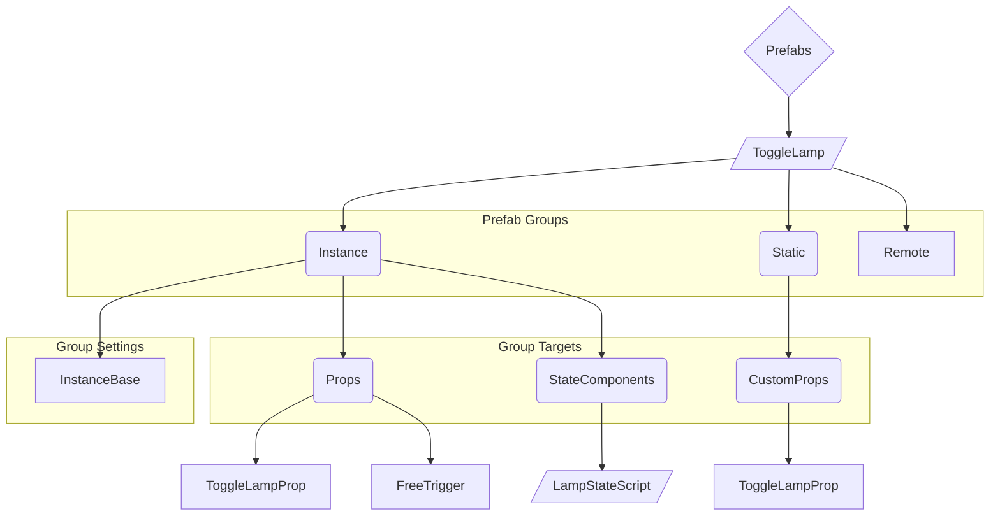

# Demystifying Prefabs // Part 1: The Basics
## Previous Entry: N/A
##     Next Entry: [1.5: StateWrangler](./1_5_StateWrangler.md) / [2.0: Advanced Attributes](./2_0_AdvancedAttributes.md)

## Intro
Hi hello welcome to this (hopefully quite short) series on InfiltrationEngine PrefabSystem - This is the "Episode 1" of sorts

Just before you we start, you are expected to understand the concepts listed here, the super important ones being
- Roblox Instances
- Instance Attributes
- Instance Properties
- The difference between attributes and properties
- The rough layout and innerworkings of custom missions

The aforementioned info will be vital to your understanding of the plugin and how it aims to aid in mission development, if you don't already understand how studio or missions themselves tick, this series doesn't aim to be a tutorial for either and will be significantly less useful to you - sorry

I do have a preamble here but I'll flash up a timestamp[^ThisWasSupposedToBeAVideo] on screen and throw it in the description if you don't want to listen to my little introduction to the plugin and this series, thanks
[^ThisWasSupposedToBeAVideo]: This explanation was initially written in the style of a YouTube video script, I don't know if I'll actually turn it into one but it felt easier to write this way

## Preamble
So for those of you sticking around for the preamble, thanks, I appreciate your interest in what I have to say and I'll try to keep it nice and brief

To give an overview of the aims of what will hopefully turn into a small video series - I've seen a lot of people interested in custom missions are rightfully very confused with what a prefab is and how to use them, and this video aims to be a sort of high-level documentation from myself to the community such that hopefully more people can understand them, because I really don't want my effort on this plugin and the accompanying SerializerAPI to go to waste. I am not a content creator by any means and actually quite despise the process of editing videos - do not expect this series to be flashy in that respect - but I would never get any of this information out in a digestible and approachable format if I decided to write a large document or try and make my own video editor

And, to give a brief introduction to prefab system and it's goals, PrefabSystem is a plugin developed by myself to allow for a workflow similar to one you might find in a better engine than Roblox Studio, whereby you can bundle collections of game assets together into one "Prefab", with some parameters given to customise how the contents of the prefab behave in one convenient place. Although there is definitely more time investment in creating complicated prefabs, you can likely imagine the incredible efficiency gains when it comes to re-using assets.

To give just one practical example, imagine you need to create your own custom disguise point using a disguise trigger and a custom prop, with each of these custom disguise points being one-time use, instead of manually copy-pasting each disguise trigger & prop all over your map, and then manually adjusting the output variables on everything every time, and debugging any mistakes you might have made, you can make one prefab, give it only the settings that you actually need, then copy & paste THAT all over your mission, adjusting many fewer settings and dealing with many fewer instances - you can even automatically generate the output variables if they're only used inside of your prefab!

This was an idea brought up to me by Roliuu, creator of the very good loud mission - even if she won't admit it - The Exchange, and immediately upon hearing of it it stuck with me until my eventually making the Serializer API and subsequently the plugin

All my marketing points out of the way, I'll let you get to what you're actually here for

## The Basics
At a high level, simple prefabs look like the following graph:

They're composed of a couple things, internally the plugin breaks these down into:
- Prefab Groups
- Group Targets
- Group Settings[^SettingsImplDetail]
[^SettingsImplDetail]: Group Settings aren't actually an internal concept (although they probably should be) - it's just useful to describe them as if they are

Prefab Groups are the foundation of everything in your prefab, being the folders right at the top of your prefab. There are currently three valid groups, seen above.

For all groups, the folders contained within should all correspond to a folder in your mission. These are **Group Targets**, and will be treated differently depending on which group they're in.

Anything inside of a group which isn't a folder is a **Group Setting**, these differ per-group. Some groups may have none where other groups may have some that are required.

To briefly touch on each of the groups we just listed, in order of Least Important -> Most Important:
- The **Remote** Group is an *extremely* niche and advanced feature you shouldn't worry about for now, you likely won't need it.
- The **Static** Group is for assets like CustomProps which you only need one copy of that are used in the **Instance** group - so you can bundle them with your prefab if you want to share it.
- The **Instance** Group is where 99% of your assets will be going, and is for Mission Elements[^MissionElements] that each copy of your prefab needs a clone of. We'll go over this in-depth now.
  
[^MissionElements]: Props, StateComponents, Geometry, etc. - even folders only used by OTHER plugins!

> [!TIP]
> Prefabs are unpacked from the structure described here into regular Mission Elements when exporting.

## The Instance Group
The Instance Group group is pretty much entirely controlled by one Setting - the **InstanceBase** part, present in the previous diagram.

This part is *extremely* important, you can think of it as a Custom Prop base - every time your prefab is used, everything in the Instance Group's targets will be cloned, and moved relative to the InstanceBase if applicable.

The InstanceBase is also where you can decide what your prefab's settings are called, and what the default values of those settings will be. Each setting corresponds to an attribute name, with the default corresponding to the value on the InstanceBase. ([Click to go to Example](#instancebase-example))

> [!NOTE]
> The InstanceBase never actually makes it into your mission, and is deleted before the map is exported

## Attributes
As you should hopefully know, the main way of configuring gameplay elements in the InfiltrationEngine is via their Attributes - PrefabSystem keeps with this flow, but allows you to insert variables into whatever attributes you like before they're put into your mission.

> [!IMPORTANT]
> When exporting, attributes on items in a prefab undergo "evaluation", where Prefab settings are applied
> 
> This is what is being referred to when "Attribute Evaluation" is mentioned

During attribute evaluation, all string attributes in every prefab go through a process where their value may be edited or replaced.

Settings from your InstanceBase may be inserted into an attribute by placing the setting name in brackets, prefixed with a dollar sign, like so: `$(SettingName)`.
If an attribute is composed of nothing but a single substitution, the attribute will be set to the exact value of the given setting - this lets you set an attribute to a number or any other non-string type. Conversely if the substitution is apart of a string then the value is inserted into the string. ([Click to go to Example](#attribute-substitution-examples))

<b>Extra-Info For Those With Lua Experience</b>

  
  The text inside of an attribute substitution `$(Here)` is what I call an Attribute Expression, and they can be *very* powerful - I won't go into full detail here but they're actually small snippets of Lua[^SmallSnippetsOfLua] using a restricted character set[^RestrictedCharSet] to make my life easy.

  They're capable of basic math, boolean operations, comparisons, concatenation, and even function calls!
  
  The full set of functions for any modern version of the plugin can be found @ [`src/LuaExprFuncs.lua`](https://github.com/Sprixitite/InfiltrationEngine-PrefabSystem/blob/main/src/LuaExprFuncs.lua)
  
  I wouldn't venture too far off course, we'll go over these in more detail in a later entry and explain the slightly odd calling convention that was adopted.

[^SmallSnippetsOfLua]: We append `return ` to the start of the expression body should it not start with the keyword
[^RestrictedCharSet]: The character set for any modern version of the plugin can be found @ [`src/Lib/LuaExpr.lua#5`](https://github.com/Sprixitite/InfiltrationEngine-PrefabSystem/blob/main/src/Lib/LuaExpr.lua#L5)

## Attribute Modifiers
Attributes are not as simple as they appear, with their names being able to contain modifiers in the format of

`priority.type.target`

where priority and type are both optional.

Priority is self explanatory, attributes beginning with lower numbers will be evaluated before those with higher numbers. All attributes with a priority will run before those without a priority, those without a priority will run in alphabetical order but this shouldn't be relied upon.

> [!NOTE]
> The one exception is any given instance's name, which undergoes attribute evaluation after every attribute.

Attributes within prefabs may belong to one "type" each. As of writing there are 5, belonging to two different categories:

There are the import types:
- `imponly`
- `noimp`
  
And the standard types:
- `peval`
- `ignore`
- `this`

> [!CAUTION]
> Import types are only for use on the InstanceBase, whereas standard types are only for use on anything inside of a Group Target, use outside of these guidelines may technically function but is not officially supported.

Import types determine how attribute defaults work with **SpongeZoneTools Attribute Importer**[^AttributeImporter], and won't be touched on further here.
[^AttributeImporter]: The attribute importer may be found [here](https://create.roblox.com/store/asset/75289472956203)

The standard types are much more interesting, operating as follows:
- The `peval` type stands for "programmable evaluate", and is complicated enough it will have to be explained later[^ProgrammableRef].
- The `ignore` type causes any attribute belonging to it to be deleted following its evaluation, this is useful in conjunction with more advanced features.
- The `this` type will set the corresponding property on whichever instance it belongs to. ([Click to go to Example](#attribute-type-example---this-))

[^ProgrammableRef]: Formerly implemented as the programmable scope, as well as the `ignore.ProgrammableDone` attribute

## Outro
I hope this has been helpful as a resource, and that you can muster tuning into the Advanced Attributes follow-up that I hopefully make happen, where we'll cover GizFuncs[^SFuncRebrand], ShebangScripts, advanced attribute substitution expressions, and the `peval` attribute scope
[^SFuncRebrand]: Formerly known as SFuncs, yeah that's right I finally thought up a slightly better name

Thanks To:
- Qeutron
- MrWD
- PinkEmeraldd
- Hydelics
- Mrshepss
- JustFreezey

For reviewing and providing feedback on this documentation before finalization

# Examples
Examples that other parts of this document may link to have been coalesced here so as to not interrupt the flow of the text.

## InstanceBase Example ([↩](#backfrom-instancebase-example))
Each for each attribute on any InstanceBase, the attribute Name is the name of a Setting on this Prefab, and the value is the default value of that setting.

## Attribute Substitution Examples ([↩](#backfrom-attribute-sub-example))
Any pair of brackets preceded by a dollar sign `$(`like this`)` inside of an attribute is treated as the name of a Prefab Setting.

If the text starts and ends with the brackets, then the type of the attribute is changed to the type of the corresponding Prefab Setting. (See: Image 1)  
If the text does not meet the above criteria, then the value is instead inserted into the rest of the string. (See: Image 2)

  
  

## Attribute Type Example - `this` ([↩](#backfrom-this-attr-example))
Setting a `this.CFrame` attribute on a Part will replace the Part's CFrame when evaluating the attributes, this can be used in conjunction with settings on your prefab to change instance properties with prefab settings

# Footnotes